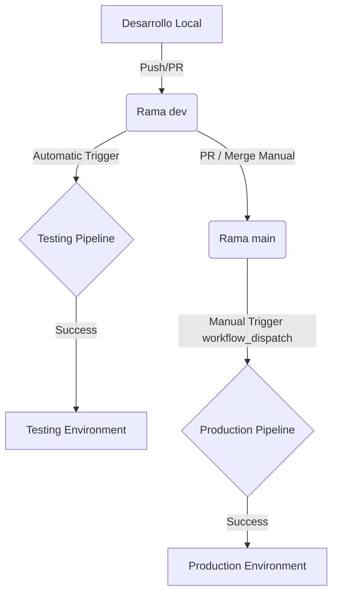

# Documentación de Despliegue (CI/CD)

Este documento detalla el funcionamiento de los pipelines de integración y despliegue continuo (CI/CD) del proyecto Tino Tasks, configurados mediante GitHub Actions para los entornos de **Testing** y **Producción**.

---

## 1. Arquitectura y Tecnologías
- **Backend**: Containerizado con Docker, empaquetado y subido a Docker Hub, y desplegado de forma serverless en **Google Cloud Run**.
- **Frontend**: Desplegado en **Vercel**, consumiendo dinámicamente la URL expuesta por el backend de Cloud Run durante el build step.
- **Base de Datos**: PostgreSQL alojada externamente, inyectada al contenedor mediante la variable de entorno `DATABASE_URL`.

---

## 2. Estrategia de Ramas y Triggers

El flujo de trabajo promueve código a través de los entornos mediante el siguiente ciclo:

1. **Testing**:
   - **Trigger**: Automático ante cualquier `push` en la rama `dev`.
   - **Propósito**: Ejecución inmediata de pruebas y provisión de un entorno efímero/testing estable.

2. **Producción**:
   - **Trigger**: Manual (`workflow_dispatch`) desde la pestaña Actions en GitHub, generalmente tras integrar la rama `dev` en `main`.
   - **Propósito**: Despliegue controlado del release candidato en producción con mayor capacidad de cómputo y dominio final.

---

## 3. Etapas de los Pipelines de CI/CD

Ambos pipelines ejecutan flujos de trabajo análogos estructurados en 4 jobs secuenciales:

### Paso 1: Pruebas Unitarias (Tests)
Se ejecutan en paralelo para aislar errores tempranamente:
* **Backend Unit Tests**:
  - Configura Node.js 22.
  - Instala dependencias con `npm ci`.
  - Ejecuta pruebas unitarias y genera cobertura mediante `npm run test:cov`.
  - Sube los resultados de cobertura como artefacto (`backend-coverage`).
* **Frontend Unit Tests**:
  - Configura Node.js 22.
  - Instala dependencias con `npm ci`.
  - Ejecuta los tests unitarios mediante `npm run test -- --coverage --passWithNoTests`.
  - Sube los resultados de cobertura como artefacto (`frontend-coverage`).

### Paso 2: Compilación y Publicación (Docker)
Una vez superadas las pruebas, se construye la imagen del backend:
- Usa `docker/setup-buildx-action` y se autentica en Docker Hub con credenciales seguras de los secretos de GitHub.
- Construye la imagen utilizando el `Dockerfile` ubicado en `./backend`.
- **Testing**: Publica la imagen bajo la etiqueta `docker.io/${DOCKERHUB_USERNAME}/tino-backend-testing:dev-${GITHUB_SHA}`.
- **Producción**: Publica la imagen bajo la etiqueta `docker.io/${DOCKERHUB_USERNAME}/tino-backend-production:dev-${GITHUB_SHA}`.

### Paso 3: Despliegue del Backend (Google Cloud Run)
El backend se despliega en Google Cloud Platform (GCP) en la región `us-central1`:
- Se autentica mediante Workload Identity Federation (WIF) evitando almacenar claves de cuentas de servicio de larga duración.
- Genera dinámicamente un archivo temporal de variables de entorno (`/tmp/env-vars.yaml`) a partir de secretos cifrados en GitHub.
- Despliega el contenedor en Cloud Run con los siguientes perfiles de recursos:
  
| Configuración | Entorno de Testing | Entorno de Producción |
| :--- | :--- | :--- |
| **Servicio** | `tino-backend-testing` | `tino-backend-production` |
| **Memoria** | 512 MiB | 2 GiB |
| **CPU** | 1 vCPU | 1 vCPU |
| **Instancias Máximas** | 1 | 1 |
| **Instancias Mínimas** | 0 | 0 |
| **Concurrency / Timeout**| 50 / 300s | 50 / 300s |

### Paso 4: Despliegue del Frontend (Vercel)
Se obtiene la URL pública del backend recién desplegado y se inyecta en el frontend:
- Instala la CLI de Vercel globalmente.
- **Testing**:
  - Ejecuta `vercel pull --environment=preview` y compila en Vercel pasando la variable de entorno `NEXT_PUBLIC_API_URL`.
  - Asigna la URL generada al alias fijo: `tino-tasks-testing.vercel.app`.
- **Producción**:
  - Ejecuta `vercel pull --environment=production`.
  - Realiza un despliegue de producción con la bandera `--prod`, mapeando y enrutando de forma automática el tráfico al dominio comprado oficial.

---

## 4. Futuras Mejoras
- **Pruebas de Integración End-to-End**: Implementación de suites automáticas con Cypress en los pipelines tras el deploy del frontend.
- **Pruebas de Carga**: Incorporar herramientas de análisis de estrés como k6 en el pipeline de testing.
- **Seguridad**: Escaneo de dependencias (npm audit / Snyk) y análisis estático de vulnerabilidades en imágenes Docker antes del push.
